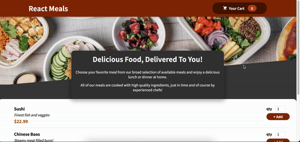

# Food Order Project

A Food Order application created with Create React App where user can add/remove food items to/from cart, rendering the total amount of items in cart along with final total price.

## Final Product

### Demo Video:

## Getting Started

1. Install dependencies using the `npm install` command.
2. Start the web server using the `npm start` command. The app will be served at <http://localhost:3000/>.
3. Go to <http://localhost:3000/> in your browser.

## Dependencies

- create react app
